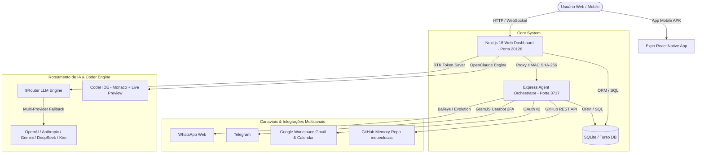

<div align="center">
  
  
  # 🚀 9Router & Ecossistema Zenda (Agente Lucas)

  **Plataforma Completa de Roteamento de IA com Economia de Tokens, Agente Autônomo Multicanal, Coder IDE estilo Bolt, Modo Voz em Tempo Real e App Mobile Nativo.**

  [](https://nextjs.org/)
  [](https://react.dev/)
  [](https://nodejs.org/)
  [](https://expo.dev/)
  [](https://maxrouter-prod.up.railway.app)
  [](https://github.com/nortelucas/9router/blob/master/LICENSE)

  [🚀 Quick Start](#-quick-start) • [💡 Módulos Principais](#-módulos-principais) • [🏗️ Arquitetura](#️-arquitetura-do-sistema) • [💻 Coder IDE](#-coder-ide--ide-estilo-bolt) • [🎙️ Modo Live Voice](#%EF%B8%8F-modo-live-voice-voz-em-tempo-real) • [📱 App Mobile](#-app-mobile-nativo-expo) • [🌐 Website](https://maxrouter-prod.up.railway.app)

</div>

---

## 📸 Demonstração Visual (Screenshots & Prints)

<div align="center">

| **Painel de Roteamento & Provedores** | **Chat Multicanal & Agente Lucas** |
| :---: | :---: |
|  |  |
| *Gestão de 40+ provedores e economia RTK* | *Inbox unificado WhatsApp, Telegram e Web* |

| **Coder IDE (Estilo Bolt)** | **App Mobile & Modo Live Voice** |
| :---: | :---: |
|  |  |
| *Editor Monaco, Live Preview e Commit GitHub* | *App React Native em tempo real por voz* |

</div>

> 📌 *As imagens acima podem ser atualizadas salvando novas capturas em `.png` na pasta [`docs/screenshots/`](file:///c:/Users/user/Documents/GitHub/9router/docs/screenshots/README.md).*

---

## 🌟 Sobre o Projeto

O **9Router (Ecossistema Zenda)** é uma solução Full-Stack completa desenvolvida em **Next.js 16**, **Node.js/Express**, **SQLite/Turso** e **React Native (Expo)**. Ela combina o poder de um **roteador inteligente de modelos de IA** com a autonomia do **Agente Lucas**, uma IDE de desenvolvimento web no próprio navegador (**Coder IDE**) e comunicação multimodal por voz.

---

## 💡 Módulos Principais

### 1. ⚡ Roteador Inteligente de LLMs (9Router Engine)
- **Economizador de Tokens RTK**: Compressão sem perdas de outputs longos de ferramentas (`git diff`, `grep`, `ls`, `tree`), economizando **20% a 40% de tokens** por requisição.
- **Ponytail (Lazy Senior Dev)**: Injeta comportamento de código enxuto, minimalista e focado no princípio YAGNI.
- **Caveman Mode**: Respostas ultra-diretas e concisas para economia extrema de tokens de saída.
- **Smart 3-Tier Fallback**: Transição automática: `Assinatura` → `Modelos Baratos` → `Modelos Gratuitos`.
- **40+ Provedores Conectados**: OpenAI, Anthropic, Gemini, DeepSeek, Groq, OpenRouter, GLM, MiniMax, Kiro AI, Vertex AI e mais.

### 2. 🤖 Agente Lucas & Orquestrador Multicanal (Zenda)
- **WhatsApp Nativo (Baileys & Evolution API)**: Conexão direta sem infraestrutura externa obrigatória, com leitura de QR Code em tempo real no dashboard.
- **Telegram Userbot (2FA & BotFather)**: Suporte completo a autenticação em duas etapas, gerenciamento de canais e respostas automáticas.
- **Google Workspace Integration**: Ferramentas nativas (*function calling*) para leitura/envio de e-mails via **Gmail API v1** e agendamentos via **Google Calendar API v3**.
- **Memória de Longo Prazo GitHub Superbrain**: O próprio repositório GitHub (`nortelucas/meueulucas`) atua como banco de memória contínuo do agente através de commits automáticos.

### 3. 💻 Coder IDE — IDE estilo Bolt
- **OpenClaude Engine**: Motor de inteligência que lê prompts de código e gera aplicações inteiras do zero no navegador.
- **Interface Completa**: Monaco Editor + Árvore de Arquivos + Live Preview ao vivo + Terminal HMR integrados.
- **Geração Frontend-First**: Criação imediata do frontend React TSX/Tailwind para preview instantâneo, seguido pelo servidor local Express (`server.js`).
- **Recursos Avançados**:
  - ✨ Botão **"Melhorar meu prompt com IA"**.
  - 📦 Exportação de projetos inteiros em arquivo **.ZIP (PKZIP)** direto no navegador.
  - 🐙 **Commit Direto no GitHub** via API REST oficial.
  - ⚡ Conexão OAuth e chaveamento para projetos no **Supabase**.

### 4. 🎙️ Modo Live Voice (Voz em Tempo Real)
- Conversação de voz contínua bidirecional no estilo *Gemini Live* / *ChatGPT Voice*.
- Respostas curtas e naturais (1 a 3 frases) otimizadas para síntese TTS.
- Disponível tanto no painel Web quanto no aplicativo Mobile.

### 5. 📱 App Mobile Nativo (Expo React Native)
- Aplicativo Android nativo localizado em [`apps/mobile`](file:///c:/Users/user/Documents/GitHub/9router/apps/mobile).
- Recursos: Chat Multimodal, 2º Cérebro Notion, Modo Live Voice.
- Script de automação e build nativo em [`build-apk.bat`](file:///c:/Users/user/Documents/GitHub/9router/apps/mobile/build-apk.bat), gerando o arquivo `app-release.apk` pronto para instalação.

### 6. 📊 CRM & Módulo de Faturamento (Billing)
- **CRM Completo** em [`/dashboard/crm`](file:///c:/Users/user/Documents/GitHub/9router/src/app/(dashboard)/dashboard/billing/page.js): Funis de vendas (Kanban), gestão de negócios (*deals*), contatos e histórico de atividades integrados ao SQLite.
- **Módulo Billing & Gateways**: Simulação e checkout com suporte a Stripe, Mercado Pago (com geração de QR Code PIX "Copia e Cola"), PayPal e OpenNode.

---

## 🏗️ Arquitetura do Sistema



---

## ⚡ Quick Start

### 1. Pré-requisitos
- **Node.js**: v20.x ou superior.
- **npm**: v9.x ou superior.

### 2. Configuração do Ambiente
Clone o repositório e crie o arquivo `.env`:

```bash
cp .env.example .env
```

### 3. Instalação de Dependências
Instale as dependências da aplicação web e do agente:

```bash
npm install
npm install --prefix apps/agent
```

### 4. Executando em Modo de Desenvolvimento
Suba o Next.js e o agente simultaneamente:

```bash
PORT=20128 NEXT_PUBLIC_BASE_URL=http://localhost:20128 npm run dev
```

Acesse o painel web em: [`http://localhost:20128/dashboard`](http://localhost:20128/dashboard) ou no chat em [`http://localhost:20128/chat`](http://localhost:20128/chat).

---

## 🐳 Execução via Docker

Você pode subir a aplicação completa containerizada via Docker Compose:

```bash
docker-compose up -d --build
```

O container garantirá a montagem do volume de dados em `/app/data` para preservar as configurações do banco SQLite.

---

## 📱 Compilação do App Mobile (APK Android)

Para gerar o APK standalone nativo do aplicativo Android no Windows:

```powershell
cd apps/mobile
.\build-apk.bat
```

O APK compilado será gerado em:
`apps/mobile/android/app/build/outputs/apk/release/app-release.apk`

---

## 🧪 Bateria de Testes Automatizados

Para executar a suíte de testes de unidade e integração (Vitest):

```bash
npm test
```

---

## 📄 Licença

Este projeto é distribuído sob a licença **MIT**. Veja o arquivo [`LICENSE`](file:///c:/Users/user/Documents/GitHub/9router/LICENSE) para mais detalhes.

<div align="center">
  <sub>Desenvolvido com ❤️ pelo ecossistema <b>Zenda / Agente Lucas</b>.</sub>
</div>